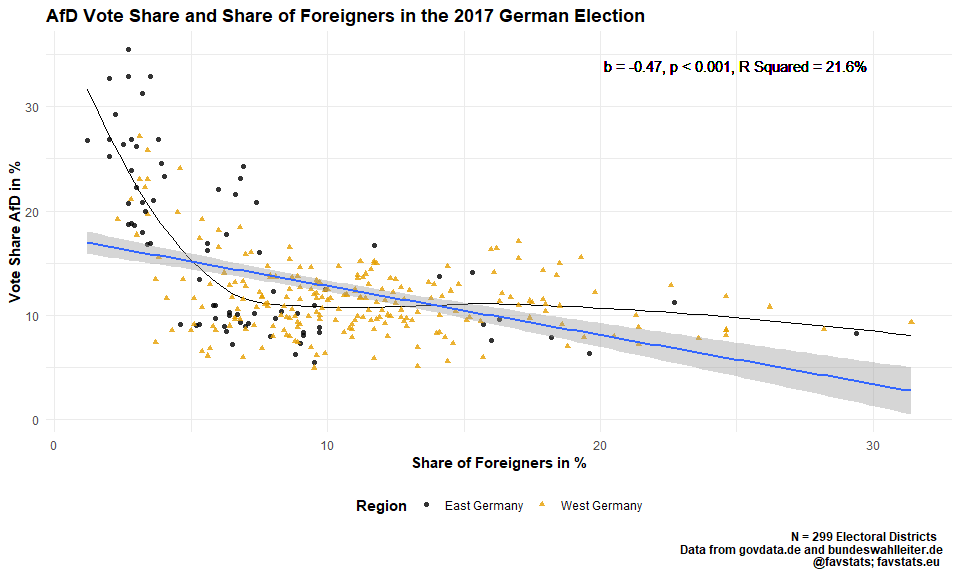
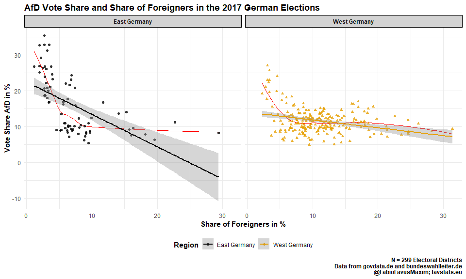
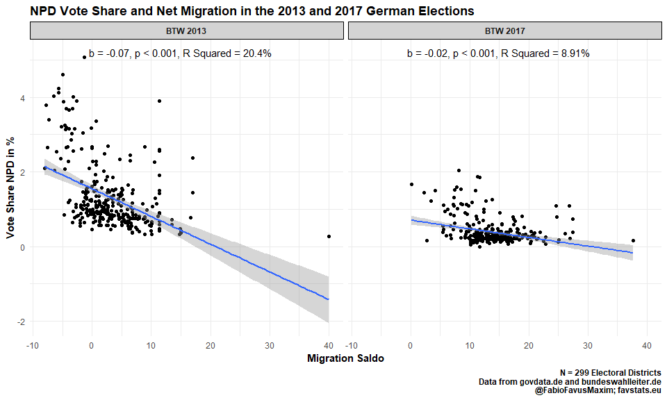
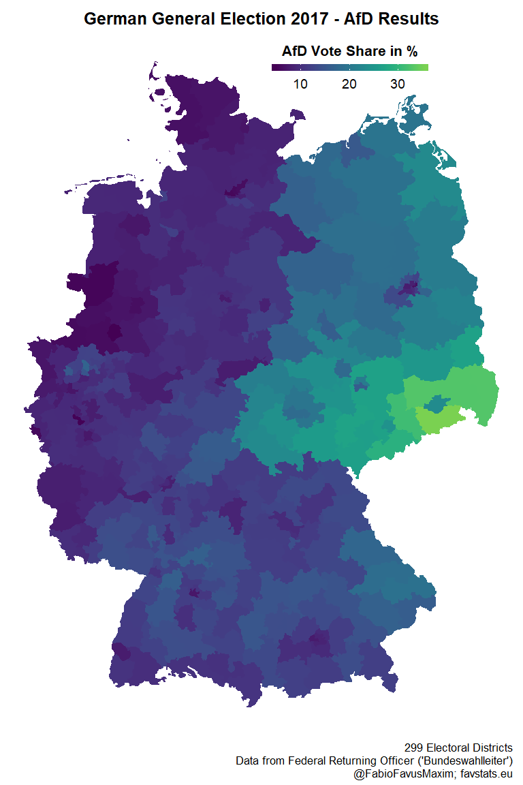
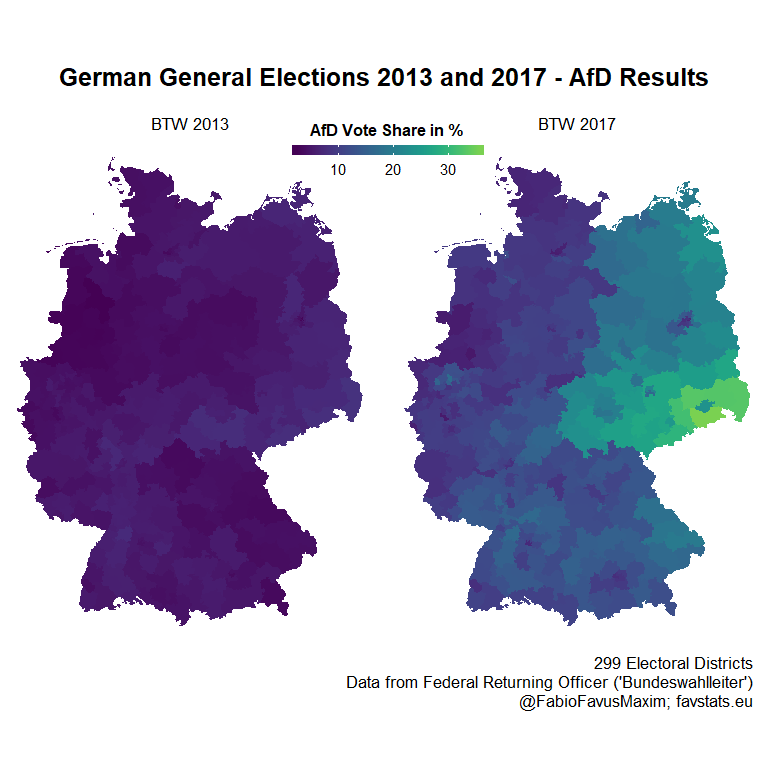
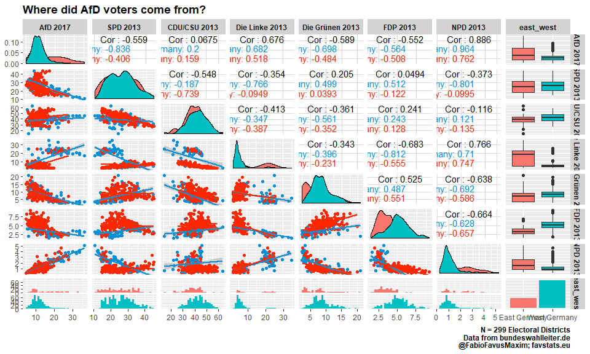

German Elections Data
================
Fabio Votta
19.09.2018

Data
Sources:

<https://www.govdata.de/web/guest/apps/-/details/bundestagswahl-2017>

<https://www.bundeswahlleiter.de/bundestagswahlen/2017/strukturdaten.html>

## Settings, Packages and Folders

``` r
options(scipen = 999)
knitr::opts_chunk$set(message = F,  warning = F, error = F, 
                      fig.align = "center", 
                      fig.width = 10, fig.height = 6)
# Install these packages if you don't have theme yet
# devtools::install_github("favstats/tidytemplate")
# install.packages("pacman")

pacman::p_load(tidyverse)

# Creates folders
# tidytemplate::data_dir()
# tidytemplate::images_dir()
```

## Helper Functions

``` r
get_percentage <- function(part, total, digits = NULL) {

  if(!is.numeric(part) | !is.numeric(total)){
    cat("Non-numeric variables.. converting\n")
    part <- as.numeric(part)
    total <- as.numeric(total)
  }
   val <- part / total * 100
   if(!is.null(digits)){
   val <- round(val, digits)
   }
  return(val) 
}


get_labs <- function (pval) 
{
  dplyr::case_when(is.na(pval) ~ "", 
                   pval < 0.001 ~ "p < 0.001",
                   pval < 0.01 ~ "p < 0.01", 
                   pval < 0.05 ~ "p < 0.05", 
                   pval < 0.1 ~  "p < 0.10", 
      TRUE ~ "p > 0.10")
}


get_r2_label <- function(mod, digits = 3, adj = F){
  if(!adj){#
    message("R Squared\n")
r2 <- broom::glance(mod) %>%
    mutate(r.squared = r.squared * 100) %>% 
    .$r.squared %>% 
    format(., digits = digits) %>% 
    paste0(., "%")
return(r2)
  } else {
    message("Getting Adjusted R Squared\n")
    r2 <- broom::glance(mod) %>%
      mutate(adj.r.squared = adj.r.squared * 100) %>% 
      .$adj.r.squared %>% 
      format(., digits = digits) %>% 
      paste0(., "%")    
return(r2)
  }
}
```

## Load Data

### BTW13

``` r
## loading in district names
district_names <- tidytemplate::load_it("data/district_names.Rdata")


vars13 <- c("wahlkreis_nr", "kreis", "part_of", "valid", "CDU", "SPD", "FDP", "DIE LINKE", "GRÜNE", "CSU", "PIRATEN", "NPD", "Tierschutzpartei", "REP", "ÖDP", "FAMILIE", "Bündnis 21/RRP", "RENTNER", "BP", "PBC", "BüSo", "DIE VIOLETTEN", "MLPD", "Volksabstimmung", "PSG", "AfD", "BIG", "pro Deutschland", "DIE RECHTE", "DIE FRAUEN", "FREIE WÄHLER", "Nichtwähler", "PARTEI DER VERNUNFT", "Die PARTEI", "B", "BGD", "DKP", "NEIN!", "Übrige")

 # ss %>% 

btw13 <- readr::read_delim("data/btw13_kerg.csv", 
                           ";", escape_double = FALSE, 
                           comment = "#", 
                           trim_ws = TRUE)  %>% 
  janitor::clean_names() %>% 
  select(nr, gebiet, geh_f6_rt, str_which(pattern = "Endg<fc>ltig", .)) %>%
  select(nr, gebiet, geh_f6_rt, str_which(pattern = "Zweitstimme", .))  %>% 
  select(-x6, -x10, -x14) %>% 
  set_names(vars13) %>% 
  mutate(cdu_csu = ifelse(is.na(CDU), CSU, CDU)) %>% 
  mutate(perc_cdu_csu = get_percentage(cdu_csu, valid)) %>%
  mutate(perc_spd = get_percentage(SPD, valid)) %>%
  mutate(perc_linke = get_percentage(`DIE LINKE`, valid)) %>%
  mutate(perc_fdp = get_percentage(FDP, valid)) %>%
  mutate(perc_grun = get_percentage(`GRÜNE`, valid)) %>%
  mutate(perc_afd = get_percentage(AfD, valid)) %>%
  mutate(NPD = ifelse(is.na(NPD), "0", NPD)) %>% 
  mutate(perc_npd = get_percentage(NPD, valid)) %>%
  select(wahlkreis_nr, kreis, part_of, valid, perc_afd, 
         perc_npd, perc_spd, perc_linke, perc_fdp, 
         perc_grun, perc_cdu_csu) %>% 
  drop_na(wahlkreis_nr) %>% 
  filter(part_of != 99)
```

    ## Non-numeric variables.. converting
    ## Non-numeric variables.. converting
    ## Non-numeric variables.. converting
    ## Non-numeric variables.. converting
    ## Non-numeric variables.. converting
    ## Non-numeric variables.. converting
    ## Non-numeric variables.. converting

``` r
strukturdaten13 <- read_delim("data/btw13_strukturdaten.csv", 
                              ";", escape_double = FALSE,
                              comment = "#", 
                              trim_ws = TRUE, 
                              col_types = cols(.default = "c")) %>% 
  janitor::clean_names() %>% 
  .[-1,] %>% 
  mutate(unemployment = str_replace(arbeitslosenquote_ende_dezember_2012_insgesamt, ",", ".") %>% as.numeric) %>% 
  mutate(sgbii = str_replace(empf_e4_nger_innen_von_leistungen_nach_sgb_ii_am_31_12_2012_insgesamt_je_1000_einwohner, ",", ".") %>% as.numeric) %>%   
  mutate(wanderung = str_replace(zu_bzw_abnahme_der_bev_f6_lkerung_2011_wanderungssaldo_je_1000_einwohner, ",", ".") %>% as.numeric) %>%  
  filter(!(str_detect(wahlkreis_name, "insgesamt|Insgesamt"))) %>% 
  select(wahlkreis_nr, wanderung, unemployment, sgbii, wahlkreis_name, land) %>%
  mutate(wahlkreis_nr = as.integer(wahlkreis_nr))

btw13_data <- btw13 %>% 
  left_join(strukturdaten13) %>% 
  select(-kreis, -wahlkreis_name) %>% 
  left_join(district_names)

tidytemplate::save_it(btw13_data)

btw13_data
```

    ## # A tibble: 299 x 15
    ##    wahlkreis_nr part_of valid perc_afd perc_npd perc_spd perc_linke
    ##           <int> <chr>   <chr>    <dbl>    <dbl>    <dbl>      <dbl>
    ##  1            1 1       1606~     4.09    0.578     32.6       5.66
    ##  2            2 1       1300~     3.84    0.564     29.7       4.41
    ##  3            3 1       1249~     4.40    0.831     30.0       5.03
    ##  4            4 1       1479~     4.39    0.577     31.5       4.36
    ##  5            5 1       1449~     3.71    0.553     34.7       6.91
    ##  6            6 1       1255~     4.70    0.923     32.7       4.77
    ##  7            7 1       1773~     4.78    0.744     31.2       5.02
    ##  8            8 1       1815~     4.97    0.720     30.1       5.02
    ##  9            9 1       1304~     4.96    0.565     31.5       4.34
    ## 10           10 1       1814~     5.63    0.759     29.7       4.94
    ## # ... with 289 more rows, and 8 more variables: perc_fdp <dbl>,
    ## #   perc_grun <dbl>, perc_cdu_csu <dbl>, wanderung <dbl>,
    ## #   unemployment <dbl>, sgbii <dbl>, land <chr>, kreis <chr>

### BTW 17

``` r
vars17 <- c("wahlkreis_nr", "kreis", "part_of", "valid", "Christlich Demokratische Union Deutschlands", "Sozialdemokratische Partei Deutschlands", "DIE LINKE", "BÜNDNIS 90/DIE GRÜNEN", "Christlich-Soziale Union in Bayern e.V.", "Freie Demokratische Partei", "Alternative für Deutschland", "Piratenpartei Deutschland", "Nationaldemokratische Partei Deutschlands", "FREIE WÄHLER", "PARTEI MENSCH UMWELT TIERSCHUTZ", "Ökologisch-Demokratische Partei", "Die PARTEI", "Bayernpartei", "Ab jetzt...Demokratie durch Volksabstimmung", "Partei der Vernunft", "Marxistisch-Leninistische Partei Deutschlands", "Bürgerrechtsbewegung Solidarität", "Sozialistische Gleichheitspartei", "DIE RECHTE", "Allianz Deutscher Demokraten", "Allianz für Menschenrechte", "bergpartei", "Bündnis Grundeinkommen", "DEMOKRATIE IN BEWEGUNG", "Deutsche Kommunistische Partei", "Deutsche Mitte", "Die Grauen – Für alle Generationen", "Die Urbane. Eine HipHop Partei", "Madgeburger Gartenpartei", "Menschliche Welt", "Partei der Humanisten", "Partei für Gesundheitsforschung", "V-Partei³ - Partei für Veränderung", "Bündnis C - Christen für Deutschland", "DIE EINHEIT", "Die Violetten", "Familien-Partei Deutschlands", "Feministische Partei DIE FRAUEN", "Mieterpartei", "Neue Liberale – Die Sozialliberalen", "UNABHÄNGIGE für bürgernahe Demokratie", "Übrige")

btw17 <- readr::read_delim("data/btw17_kerg.csv", 
                           ";", escape_double = FALSE, comment = "#", 
                           trim_ws = TRUE)  %>% 
  janitor::clean_names() %>% 
  select(nr, gebiet, gehort_zu, grep("Endgültig", .)) %>%
  select(nr, gebiet, gehort_zu, grep("Zweitstimme", .)) %>% 
  select(-x6, -x10, -x14) %>% 
  set_names(vars17) %>% 
  mutate(cdu_csu = ifelse(is.na(`Christlich Demokratische Union Deutschlands`), 
                          `Christlich-Soziale Union in Bayern e.V.`, 
                          `Christlich Demokratische Union Deutschlands`)) %>% 
  mutate(perc_cdu_csu = get_percentage(cdu_csu, valid)) %>%
  mutate(perc_spd = get_percentage(`Sozialdemokratische Partei Deutschlands`, valid)) %>%
  mutate(perc_linke = get_percentage(`DIE LINKE`, valid)) %>%
  mutate(perc_fdp = get_percentage(`Freie Demokratische Partei`, valid)) %>%
  mutate(perc_grun = get_percentage(`BÜNDNIS 90/DIE GRÜNEN`, valid)) %>%
  mutate(perc_afd = get_percentage(`Alternative für Deutschland`, valid)) %>%
  mutate(NPD = ifelse(is.na(`Nationaldemokratische Partei Deutschlands`), 
                      "0", 
                      `Nationaldemokratische Partei Deutschlands`)) %>% 
  mutate(perc_npd = get_percentage(NPD, valid)) %>%
  select(wahlkreis_nr, kreis, part_of, valid, perc_afd, 
         perc_npd, perc_spd, perc_linke, perc_fdp, 
         perc_grun, perc_cdu_csu) %>% 
  drop_na(wahlkreis_nr) %>% 
  filter(part_of != 99)
```

    ## Non-numeric variables.. converting
    ## Non-numeric variables.. converting
    ## Non-numeric variables.. converting
    ## Non-numeric variables.. converting
    ## Non-numeric variables.. converting
    ## Non-numeric variables.. converting
    ## Non-numeric variables.. converting

``` r
btw17
```

    ## # A tibble: 299 x 11
    ##    wahlkreis_nr kreis part_of valid perc_afd perc_npd perc_spd perc_linke
    ##           <int> <chr>   <int> <chr>    <dbl>    <dbl>    <dbl>      <dbl>
    ##  1            1 Flen~       1 1704~     6.84    0.205     23.7       8.21
    ##  2            2 Nord~       1 1380~     6.54    0.218     22.5       6.22
    ##  3            3 Stei~       1 1308~     8.54    0.360     22.7       6.67
    ##  4            4 Rend~       1 1562~     7.41    0.196     22.9       6.37
    ##  5            5 Kiel        1 1520~     6.91    0.164     23.8      10.2 
    ##  6            6 Plön~       1 1305~     8.55    0.367     23.8       6.52
    ##  7            7 Pinn~       1 1863~     8.57    0.239     22.9       7.03
    ##  8            8 Sege~       1 1919~     8.94    0.241     22.4       6.90
    ##  9            9 Osth~       1 1372~     8.58    0.219     24.6       6.05
    ## 10           10 Herz~       1 1919~     9.79    0.256     22.3       6.50
    ## # ... with 289 more rows, and 3 more variables: perc_fdp <dbl>,
    ## #   perc_grun <dbl>, perc_cdu_csu <dbl>

``` r
strukturdaten17 <- read_delim("data/btw17_strukturdaten.csv", 
                              ";", escape_double = FALSE,
                              col_types = cols(.default = "c"), 
                              comment = "#", 
                              trim_ws = TRUE, 
                              skip = 1) %>% 
  janitor::clean_names() %>% 
  mutate(unemployment = str_replace(arbeitslosenquote_marz_2017_insgesamt, ",", ".") %>% as.numeric) %>% 
  mutate(wanderung = str_replace(zu_bzw_abnahme_der_bev_f6_lkerung_2015_wanderungssaldo_je_1000_einwohner, ",", ".") %>% as.numeric) %>% 
  mutate(sgbii = str_replace(empfanger_innen_von_leistungen_nach_sgb_ii_am_31_12_2016_insgesamt_je_1000_einwohner, ",", ".") %>% as.numeric) %>% 
  filter(!(str_detect(wahlkreis_name, "insgesamt|Insgesamt"))) %>% 
  select(wahlkreis_nr, unemployment, wanderung, sgbii, wahlkreis_name, land) %>%
  mutate(wahlkreis_nr = as.integer(wahlkreis_nr))

btw17_data <- btw17 %>% 
  left_join(strukturdaten17) %>% 
  select(-kreis, -wahlkreis_name) %>% 
  left_join(district_names)

tidytemplate::save_it(btw17_data)

btw17_data
```

    ## # A tibble: 299 x 15
    ##    wahlkreis_nr part_of valid perc_afd perc_npd perc_spd perc_linke
    ##           <int>   <int> <chr>    <dbl>    <dbl>    <dbl>      <dbl>
    ##  1            1       1 1704~     6.84    0.205     23.7       8.21
    ##  2            2       1 1380~     6.54    0.218     22.5       6.22
    ##  3            3       1 1308~     8.54    0.360     22.7       6.67
    ##  4            4       1 1562~     7.41    0.196     22.9       6.37
    ##  5            5       1 1520~     6.91    0.164     23.8      10.2 
    ##  6            6       1 1305~     8.55    0.367     23.8       6.52
    ##  7            7       1 1863~     8.57    0.239     22.9       7.03
    ##  8            8       1 1919~     8.94    0.241     22.4       6.90
    ##  9            9       1 1372~     8.58    0.219     24.6       6.05
    ## 10           10       1 1919~     9.79    0.256     22.3       6.50
    ## # ... with 289 more rows, and 8 more variables: perc_fdp <dbl>,
    ## #   perc_grun <dbl>, perc_cdu_csu <dbl>, unemployment <dbl>,
    ## #   wanderung <dbl>, sgbii <dbl>, land <chr>, kreis <chr>

## All Together

``` r
btw13_data <- tidytemplate::load_it("data/btw13_data.Rdata")
btw17_data <- tidytemplate::load_it("data/btw17_data.Rdata")

btw_data <- bind_rows(btw17_data %>% 
  mutate(year = "BTW 2017") %>% 
  mutate(part_of = as.character(part_of)),
  btw13_data %>% 
    mutate(year = "BTW 2013"))  %>% 
  mutate(east_west = case_when(
    str_detect(land, "Berlin|Brand|Nieder|Sachs") ~ "East Germany",
    T ~ "West Germany"
  )) 

tidytemplate::save_it(btw_data)

btw_data
```

    ## # A tibble: 598 x 17
    ##    wahlkreis_nr part_of valid perc_afd perc_npd perc_spd perc_linke
    ##           <int> <chr>   <chr>    <dbl>    <dbl>    <dbl>      <dbl>
    ##  1            1 1       1704~     6.84    0.205     23.7       8.21
    ##  2            2 1       1380~     6.54    0.218     22.5       6.22
    ##  3            3 1       1308~     8.54    0.360     22.7       6.67
    ##  4            4 1       1562~     7.41    0.196     22.9       6.37
    ##  5            5 1       1520~     6.91    0.164     23.8      10.2 
    ##  6            6 1       1305~     8.55    0.367     23.8       6.52
    ##  7            7 1       1863~     8.57    0.239     22.9       7.03
    ##  8            8 1       1919~     8.94    0.241     22.4       6.90
    ##  9            9 1       1372~     8.58    0.219     24.6       6.05
    ## 10           10 1       1919~     9.79    0.256     22.3       6.50
    ## # ... with 588 more rows, and 10 more variables: perc_fdp <dbl>,
    ## #   perc_grun <dbl>, perc_cdu_csu <dbl>, unemployment <dbl>,
    ## #   wanderung <dbl>, sgbii <dbl>, land <chr>, kreis <chr>, year <chr>,
    ## #   east_west <chr>

### Unemployment

#### AfD

``` r
mod13 <- lm(perc_afd ~ unemployment, data = btw13_data)
mod17 <- lm(perc_afd ~ unemployment, data = btw17_data)

r2_13 <- get_r2_label(mod13)
r2_17 <- get_r2_label(mod17)

label_dat <- tibble(year = c("BTW 2013", "BTW 2017"),
     text =   c(
broom::tidy(mod13) %>% 
  filter(term == "unemployment") %>% 
  mutate(text = paste0("b = ", round(estimate, 2), 
         ", ", get_labs(p.value),
         ", R Squared = ", r2_13)) %>% 
  .$text,

broom::tidy(mod17) %>% 
  filter(term == "unemployment") %>% 
  mutate(text = paste0("b = ", round(estimate, 2), 
         ", ", get_labs(p.value),
         ", R Squared = ", r2_17)) %>% 
  .$text
))

gg_afd <- btw_data %>% 
  ggplot(aes(unemployment, perc_afd)) +
  geom_point() +
  geom_smooth(method = "lm") +
  facet_wrap(~year) +
  theme_minimal() +
  geom_text(data = label_dat, aes(y = 34, x = 8, label = text), show.legend = F) +
  labs(x = "Unemployment Rate in %", y = "Vote Share AfD in %",
       title = "AfD Vote Share and Unemployment Rate in the 2013 and 2017 German Elections",
       caption = "N = 299 Electoral Districts\nData from govdata.de and bundeswahlleiter.de\n@FabioFavusMaxim; favstats.eu") +
  theme(title = element_text(face = "bold"), 
        strip.background = element_rect(fill = "lightgrey"), 
        strip.text = element_text(face = "bold"))

gg_afd
```


``` r
tidytemplate::ggsave_it(gg_afd, width = 10, height = 6)
```

##### East-West

``` r
gg_afd_eastwest <- btw_data %>% 
  ggplot(aes(unemployment, perc_afd, color = east_west)) +
  geom_point(aes(shape = east_west), alpha = 0.8) +
  geom_smooth(method = "lm") +
  facet_wrap(~year) +
  theme_minimal() +
  labs(x = "Unemployment Rate in %", y = "Vote Share AfD in %",
       title = "AfD Vote Share and Unemployment Rate in the 2013 and 2017 German Elections",
       caption = "N = 299 Electoral Districts\nData from govdata.de and bundeswahlleiter.de\n@FabioFavusMaxim; favstats.eu")  +
  theme(title = element_text(face = "bold"), 
        strip.background = element_rect(fill = "lightgrey"), 
        strip.text = element_text(face = "bold"),
        legend.position = "bottom") +
  ggthemes::scale_color_colorblind("Region") +
  guides(shape = F)

gg_afd_eastwest
```


``` r
tidytemplate::ggsave_it(gg_afd_eastwest, width = 10, height = 6)
```

#### NPD

``` r
mod13 <- lm(perc_npd ~ unemployment, data = btw13_data)
mod17 <- lm(perc_npd ~ unemployment, data = btw17_data)

r2_13 <- get_r2_label(mod13)
r2_17 <- get_r2_label(mod17)

label_dat <- tibble(year = c("BTW 2013", "BTW 2017"),
     text =   c(
broom::tidy(mod13) %>% 
  filter(term == "unemployment") %>% 
  mutate(text = paste0("b = ", round(estimate, 2), 
         ", ", get_labs(p.value),
         ", R Squared = ", r2_13)) %>% 
  .$text,

broom::tidy(mod17) %>% 
  filter(term == "unemployment") %>% 
  mutate(text = paste0("b = ", round(estimate, 2), 
         ", ", get_labs(p.value),
         ", R Squared = ", r2_17)) %>% 
  .$text
))

gg_npd <- btw_data %>% 
  ggplot(aes(unemployment, perc_npd)) +
  geom_point() +
  geom_smooth(method = "lm") +
  facet_wrap(~year) +
  theme_minimal() +
  geom_text(data = label_dat, aes(y = 5.2, x = 8, label = text), show.legend = F) +
  labs(x = "Unemployment Rate in %", y = "Vote Share npd in %",
       title = "NPD Vote Share and Unemployment Rate in the 2013 and 2017 German Elections",
       caption = "N = 299 Electoral Districts\nData from govdata.de and bundeswahlleiter.de\n@FabioFavusMaxim; favstats.eu") +
  theme(title = element_text(face = "bold"), 
        strip.background = element_rect(fill = "lightgrey"), 
        strip.text = element_text(face = "bold"))

gg_npd
```


``` r
tidytemplate::ggsave_it(gg_npd, width = 10, height = 6)
```

##### East-West

``` r
gg_npd_eastwest <- btw_data %>% 
  ggplot(aes(unemployment, perc_npd, color = east_west)) +
  geom_point(aes(shape = east_west), alpha = 0.8) +
  geom_smooth(method = "lm") +
  facet_wrap(~year) +
  theme_minimal() +
  labs(x = "Unemployment Rate in %", y = "Vote Share npd in %",
       title = "NPD Vote Share and Unemployment Rate in the 2013 and 2017 German Elections",
       caption = "N = 299 Electoral Districts\nData from govdata.de and bundeswahlleiter.de\n@FabioFavusMaxim; favstats.eu")  +
  theme(title = element_text(face = "bold"), 
        strip.background = element_rect(fill = "lightgrey"), 
        strip.text = element_text(face = "bold"),
        legend.position = "bottom") +
  ggthemes::scale_color_colorblind("Region")  +
  guides(shape = F)

gg_npd_eastwest
```


``` r
tidytemplate::ggsave_it(gg_npd_eastwest, width = 10, height = 6)
```

#### Linke

``` r
mod13 <- lm(perc_linke ~ unemployment, data = btw13_data)
mod17 <- lm(perc_linke ~ unemployment, data = btw17_data)

r2_13 <- get_r2_label(mod13)
r2_17 <- get_r2_label(mod17)

label_dat <- tibble(year = c("BTW 2013", "BTW 2017"),
     text =   c(
broom::tidy(mod13) %>% 
  filter(term == "unemployment") %>% 
  mutate(text = paste0("b = ", round(estimate, 2), 
         ", ", get_labs(p.value),
         ", R Squared = ", r2_13)) %>% 
  .$text,

broom::tidy(mod17) %>% 
  filter(term == "unemployment") %>% 
  mutate(text = paste0("b = ", round(estimate, 2), 
         ", ", get_labs(p.value),
         ", R Squared = ", r2_17)) %>% 
  .$text
))

gg_linke <- btw_data %>% 
  ggplot(aes(unemployment, perc_linke)) +
  geom_point() +
  geom_smooth(method = "lm") +
  facet_wrap(~year) +
  theme_minimal() +
  geom_text(data = label_dat, aes(y = 34, x = 8, label = text), show.legend = F) +
  labs(x = "Unemployment Rate in %", y = "Vote Share 'Die Linke' in %",
       title = "'Die Linke' Vote Share and Unemployment Rate in the 2013 and 2017 German Elections",
       caption = "N = 299 Electoral Districts\nData from govdata.de and bundeswahlleiter.de\n@FabioFavusMaxim; favstats.eu") +
  theme(title = element_text(face = "bold"), 
        strip.background = element_rect(fill = "lightgrey"), 
        strip.text = element_text(face = "bold"))

gg_linke
```


``` r
tidytemplate::ggsave_it(gg_linke, width = 10, height = 6)
```

##### East-West

``` r
gg_linke_eastwest <- btw_data %>% 
  ggplot(aes(unemployment, perc_linke, color = east_west)) +
  geom_point(aes(shape = east_west), alpha = 0.8) +
  geom_smooth(method = "lm") +
  facet_wrap(~year) +
  theme_minimal() +
  labs(x = "Unemployment Rate in %", y = "Vote Share 'Die Linke in %",
       title = "'Die Linke' Vote Share and Unemployment Rate in the 2013 and 2017 German Elections",
       caption = "N = 299 Electoral Districts\nData from govdata.de and bundeswahlleiter.de\n@FabioFavusMaxim; favstats.eu")  +
  theme(title = element_text(face = "bold"), 
        strip.background = element_rect(fill = "lightgrey"), 
        strip.text = element_text(face = "bold"),
        legend.position = "bottom") +
  ggthemes::scale_color_colorblind("Region")  +
  guides(shape = F)

gg_linke_eastwest
```


``` r
tidytemplate::ggsave_it(gg_linke_eastwest, width = 10, height = 6)
```

### Migration

#### AfD

``` r
mod13 <- lm(perc_afd ~ wanderung, data = btw13_data)
mod17 <- lm(perc_afd ~ wanderung, data = btw17_data)

r2_13 <- get_r2_label(mod13)
r2_17 <- get_r2_label(mod17)

label_dat <- tibble(year = c("BTW 2013", "BTW 2017"),
     text =   c(
broom::tidy(mod13) %>% 
  filter(term == "wanderung") %>% 
  mutate(text = paste0("b = ", round(estimate, 2), 
         ", ", get_labs(p.value),
         ", R Squared = ", r2_13)) %>% 
  .$text,

broom::tidy(mod17) %>% 
  filter(term == "wanderung") %>% 
  mutate(text = paste0("b = ", round(estimate, 2), 
         ", ", get_labs(p.value),
         ", R Squared = ", r2_17)) %>% 
  .$text
))

gg_afd_wanderung <- btw_data %>% 
  ggplot(aes(wanderung, perc_afd)) +
  geom_point() +
  geom_smooth(method = "lm") +
  facet_wrap(~year) +
  theme_minimal() +
  geom_text(data = label_dat, aes(y = 34, x = 15, label = text), show.legend = F) +
  labs(x = "Migration Saldo", y = "Vote Share AfD in %",
       title = "AfD Vote Share and Net Migration in the 2013 and 2017 German Elections",
       caption = "N = 299 Electoral Districts\nData from govdata.de and bundeswahlleiter.de\n@FabioFavusMaxim; favstats.eu") +
  theme(title = element_text(face = "bold"), 
        strip.background = element_rect(fill = "lightgrey"), 
        strip.text = element_text(face = "bold"))

gg_afd_wanderung
```


``` r
tidytemplate::ggsave_it(gg_afd_wanderung, width = 10, height = 6)
```

##### East-West

``` r
gg_afd_eastwest_wanderung <- btw_data %>% 
  ggplot(aes(wanderung, perc_afd, color = east_west)) +
  geom_point(aes(shape = east_west), alpha = 0.8) +
  geom_smooth(method = "lm") +
  facet_wrap(~year) +
  theme_minimal() +
  labs(x = "Migration Saldo", y = "Vote Share AfD in %",
       title = "AfD Vote Share and Net Migration in the 2013 and 2017 German Elections",
       caption = "N = 299 Electoral Districts\nData from govdata.de and bundeswahlleiter.de\n@FabioFavusMaxim; favstats.eu")  +
  theme(title = element_text(face = "bold"), 
        strip.background = element_rect(fill = "lightgrey"), 
        strip.text = element_text(face = "bold"),
        legend.position = "bottom") +
  ggthemes::scale_color_colorblind("Region") +
  guides(shape = F)

gg_afd_eastwest_wanderung
```


``` r
tidytemplate::ggsave_it(gg_afd_eastwest_wanderung, width = 10, height = 6)
```

##### Just BTW 2017

``` r
gg_afd_wanderung17 <- btw_data %>% 
  filter(year == "BTW 2017") %>% 
  ggplot(aes(wanderung, perc_afd, color = east_west)) +
  geom_point(aes(shape = east_west), alpha = 0.8) +
  geom_smooth(method = "lm") +
  theme_minimal() +
  # geom_text(data = label_dat %>% 
  #             filter(year == "BTW 2017"), aes(y = 34, x = 15, label = text), show.legend = F) +
  labs(x = "Net Migration per 1000 inhabitants", y = "Vote Share AfD in %",
       title = "AfD Vote Share and Net Migration in the 2017 German Elections",
       caption = "N = 299 Electoral Districts\nData from govdata.de and bundeswahlleiter.de\n@FabioFavusMaxim; favstats.eu")   +
  theme(title = element_text(face = "bold"), 
        strip.background = element_rect(fill = "lightgrey"), 
        strip.text = element_text(face = "bold"),
        legend.position = "bottom") +
  ggthemes::scale_color_colorblind("Region") +
  guides(shape = F)

gg_afd_wanderung17
```


``` r
tidytemplate::ggsave_it(gg_afd_wanderung17, width = 10, height = 6)
```

#### NPD

``` r
mod13 <- lm(perc_npd ~ wanderung, data = btw13_data)
mod17 <- lm(perc_npd ~ wanderung, data = btw17_data)

r2_13 <- get_r2_label(mod13)
r2_17 <- get_r2_label(mod17)

label_dat <- tibble(year = c("BTW 2013", "BTW 2017"),
     text =   c(
broom::tidy(mod13) %>% 
  filter(term == "wanderung") %>% 
  mutate(text = paste0("b = ", round(estimate, 2), 
         ", ", get_labs(p.value),
         ", R Squared = ", r2_13)) %>% 
  .$text,

broom::tidy(mod17) %>% 
  filter(term == "wanderung") %>% 
  mutate(text = paste0("b = ", round(estimate, 2), 
         ", ", get_labs(p.value),
         ", R Squared = ", r2_17)) %>% 
  .$text
))

gg_npd_wanderung <- btw_data %>% 
  ggplot(aes(wanderung, perc_npd)) +
  geom_point() +
  geom_smooth(method = "lm") +
  facet_wrap(~year) +
  theme_minimal() +
  geom_text(data = label_dat, aes(y = 5.2, x = 15, label = text), show.legend = F) +
  labs(x = "Migration Saldo", y = "Vote Share NPD in %",
       title = "NPD Vote Share and Net Migration in the 2013 and 2017 German Elections",
       caption = "N = 299 Electoral Districts\nData from govdata.de and bundeswahlleiter.de\n@FabioFavusMaxim; favstats.eu") +
  theme(title = element_text(face = "bold"), 
        strip.background = element_rect(fill = "lightgrey"), 
        strip.text = element_text(face = "bold"))

gg_npd_wanderung
```



``` r
tidytemplate::ggsave_it(gg_npd_wanderung, width = 10, height = 6)
```

##### East-West

``` r
gg_npd_eastwest_wanderung <- btw_data %>% 
  ggplot(aes(wanderung, perc_npd, color = east_west)) +
  geom_point(aes(shape = east_west), alpha = 0.8) +
  geom_smooth(method = "lm") +
  facet_wrap(~year) +
  theme_minimal() +
  labs(x = "Migration Saldo", y = "Vote Share NPD in %",
       title = "NPD Vote Share and Net Migration in the 2013 and 2017 German Elections",
       caption = "N = 299 Electoral Districts\nData from govdata.de and bundeswahlleiter.de\n@FabioFavusMaxim; favstats.eu")  +
  theme(title = element_text(face = "bold"), 
        strip.background = element_rect(fill = "lightgrey"), 
        strip.text = element_text(face = "bold"),
        legend.position = "bottom") +
  ggthemes::scale_color_colorblind("Region")  +
  guides(shape = F)

gg_npd_eastwest_wanderung
```



``` r
tidytemplate::ggsave_it(gg_npd_eastwest_wanderung, width = 10, height = 6)
```

#### Linke

``` r
mod13 <- lm(perc_linke ~ wanderung, data = btw13_data)
mod17 <- lm(perc_linke ~ wanderung, data = btw17_data)

r2_13 <- get_r2_label(mod13)
r2_17 <- get_r2_label(mod17)

label_dat <- tibble(year = c("BTW 2013", "BTW 2017"),
     text =   c(
broom::tidy(mod13) %>% 
  filter(term == "wanderung") %>% 
  mutate(text = paste0("b = ", round(estimate, 2), 
         ", ", get_labs(p.value),
         ", R Squared = ", r2_13)) %>% 
  .$text,

broom::tidy(mod17) %>% 
  filter(term == "wanderung") %>% 
  mutate(text = paste0("b = ", round(estimate, 2), 
         ", ", get_labs(p.value),
         ", R Squared = ", r2_17)) %>% 
  .$text
))

gg_linke_wanderung <- btw_data %>% 
  ggplot(aes(wanderung, perc_linke)) +
  geom_point() +
  geom_smooth(method = "lm") +
  facet_wrap(~year) +
  theme_minimal() +
  geom_text(data = label_dat, aes(y = 34, x = 15, label = text), show.legend = F) +
  labs(x = "Migration Saldo", y = "Vote Share 'Die Linke' in %",
       title = "'Die Linke' Vote Share and Net Migration in the 2013 and 2017 German Elections",
       caption = "N = 299 Electoral Districts\nData from govdata.de and bundeswahlleiter.de\n@FabioFavusMaxim; favstats.eu") +
  theme(title = element_text(face = "bold"), 
        strip.background = element_rect(fill = "lightgrey"), 
        strip.text = element_text(face = "bold"))

gg_linke_wanderung
```



``` r
tidytemplate::ggsave_it(gg_linke_wanderung, width = 10, height = 6)
```

##### East-West

``` r
gg_linke_eastwest_wanderung <- btw_data %>% 
  ggplot(aes(wanderung, perc_linke, color = east_west)) +
  geom_point(aes(shape = east_west), alpha = 0.8) +
  geom_smooth(method = "lm") +
  facet_wrap(~year) +
  theme_minimal() +
  labs(x = "Migration Saldo", y = "Vote Share 'Die Linke in %",
       title = "'Die Linke' Vote Share and Net Migration in the 2013 and 2017 German Elections",
       caption = "N = 299 Electoral Districts\nData from govdata.de and bundeswahlleiter.de\n@FabioFavusMaxim; favstats.eu")  +
  theme(title = element_text(face = "bold"), 
        strip.background = element_rect(fill = "lightgrey"), 
        strip.text = element_text(face = "bold"),
        legend.position = "bottom") +
  ggthemes::scale_color_colorblind("Region")  +
  guides(shape = F)

gg_linke_eastwest_wanderung
```


``` r
tidytemplate::ggsave_it(gg_linke_eastwest_wanderung, width = 10, height = 6)
```

## Where did the AfD come from?

``` r
btw_lagged_all <- btw_data %>% 
  filter(year == "BTW 2017") %>%
  select(wahlkreis_nr, perc_afd) %>% 
left_join(
  btw_data %>% 
  filter(year == "BTW 2013") %>%
  select(wahlkreis_nr, perc_spd, perc_cdu_csu, perc_linke, 
         perc_grun, perc_fdp, perc_npd))  %>% 
  rename(`AfD 2017` = perc_afd,
         `SPD 2013` = perc_spd,
         `CDU/CSU 2013` = perc_cdu_csu,
         `Die Linke 2013` = perc_linke,
         `Die Grünen 2013` = perc_grun,
         `FDP 2013` = perc_fdp,
         `NPD 2013` = perc_npd) %>% 
left_join(
  btw_data %>% select(wahlkreis_nr, east_west)) %>% 
  select(-wahlkreis_nr) 

btw_lagged_all
```

    ## # A tibble: 598 x 8
    ##    `AfD 2017` `SPD 2013` `CDU/CSU 2013` `Die Linke 2013` `Die Grünen 201~
    ##         <dbl>      <dbl>          <dbl>            <dbl>            <dbl>
    ##  1       6.84       32.6           38.2             5.66             9.79
    ##  2       6.84       32.6           38.2             5.66             9.79
    ##  3       6.54       29.7           43.4             4.41             8.11
    ##  4       6.54       29.7           43.4             4.41             8.11
    ##  5       8.54       30.0           41.9             5.03             7.59
    ##  6       8.54       30.0           41.9             5.03             7.59
    ##  7       7.41       31.5           40.8             4.36             9.26
    ##  8       7.41       31.5           40.8             4.36             9.26
    ##  9       6.91       34.7           30.3             6.91            14.1 
    ## 10       6.91       34.7           30.3             6.91            14.1 
    ## # ... with 588 more rows, and 3 more variables: `FDP 2013` <dbl>, `NPD
    ## #   2013` <dbl>, east_west <chr>

``` r
afd_origin <- btw_lagged_all %>% 
  gather(parties, perc, -east_west, -`AfD 2017`) %>% 
  ggplot(aes(perc, `AfD 2017`, 
             color = east_west, 
             shape = east_west)) +
  geom_point(alpha = 0.6) +
  geom_smooth(method = "lm") +
  facet_wrap(~parties, scales = "free") +
  ggthemes::scale_color_colorblind("Region") +
  theme_minimal()  +
  labs(x = "2013 Vote Share in Percent", 
       y = "AfD Vote Share in 2017",
       title = "Where did AfD voters come from?", 
       subtitle = "Comparing 2013 Election results with Vote Share of the AfD in the 2017 Election on the Electoral District Level",
       caption = "N = 299 Electoral Districts\nData from Federal Returning Officer ('Bundeswahlleiter')\n@FabioFavusMaxim; favstats.eu") +
  theme(title = element_text(face = "bold"), 
        strip.background = element_rect(fill = "lightgrey"), 
        strip.text = element_text(face = "bold"),
        legend.position = "bottom") +
  guides(shape = F) #+
  # ggpubr::stat_cor()

afd_origin
```


``` r
tidytemplate::ggsave_it(afd_origin, width = 12, height = 8)
```

**To-Do**

## mapping

``` r
btw_data <- tidytemplate::load_it("data/btw_data.Rdata")

library(rgdal)
btw_raw <- readOGR("data/Geometrie_Wahlkreise_19DBT_geo.shp") 
```

    ## OGR data source with driver: ESRI Shapefile 
    ## Source: "C:\Users\Fabio\Documents\git_proj\btw_data\data\Geometrie_Wahlkreise_19DBT_geo.shp", layer: "Geometrie_Wahlkreise_19DBT_geo"
    ## with 299 features
    ## It has 4 fields
    ## Integer64 fields read as strings:  WKR_NR

``` r
plot(btw_raw)
```


``` r
btw_map_dat <- btw_raw@data%>% 
  as.data.frame() %>% 
  rownames_to_column("id")

btw_map_wt <- spTransform(btw_raw, CRS("+proj=longlat +datum=WGS84"))

btw_map <- fortify(btw_map_wt) %>% 
  left_join(btw_map_dat, by = "id")


btw_map13 <- btw_data %>% 
  filter(year == "BTW 2013") %>% 
  inner_join(btw_map %>% 
  rename(wahlkreis_nr = WKR_NR) %>% 
  mutate(wahlkreis_nr = as.character(wahlkreis_nr) %>% as.integer))

btw_map17 <- btw_data %>% 
  filter(year == "BTW 2017") %>% 
  inner_join(btw_map %>% 
  rename(wahlkreis_nr = WKR_NR) %>% 
  mutate(wahlkreis_nr = as.character(wahlkreis_nr) %>% as.integer))


# btw_map <- bind_rows(btw_map13 %>% 
#             mutate(year = "BTW 2013"), 
#           btw_map17 %>% 
#             mutate(year = "BTW 2017"))
```

``` r
btw_map <- bind_rows(btw_map13 %>% 
            mutate(year = "BTW 2013"), 
          btw_map17 %>% 
            mutate(year = "BTW 2017"))

gg_btw_map17 <- btw_map17 %>% 
  ggplot(aes(fill = perc_afd)) +
  geom_map(map = btw_map17,
         aes(x = long, y = lat, group = group, map_id = id),
         color = NA, size = 0.4)  + 
  theme_void() +
  # facet_wrap(~year) +
  coord_map() +
  viridis::scale_fill_viridis("AfD Vote Share in %",
                               option = "D", discrete = F, end = .8) +
                       #       limits = c(1, 10),
                       # breaks = c(1:10),
                       # labels = c(1:10)) +
  theme(plot.title = element_text(hjust = 0.5, size = 19, face = "bold"),
    legend.justification = c(1, 0),
    legend.position = c(0.82, 0.91),
    legend.title = element_text(size = 16, face = "bold"), 
    strip.text = element_text(size = 12),
    #axis.ticks.length = unit(3, "cm"),
    legend.direction = "horizontal",
    plot.caption = element_text(size = 13)) +
  guides(fill = guide_colorbar(barwidth = 12, barheight = 0.5,
                title.position = "top", title.hjust = 0.5,
                label.theme = element_text(colour = "black", size = 14, angle = 0))) +
  labs(title = "German General Election 2017 - AfD Results", 
       caption = "299 Electoral Districts   \nData from Federal Returning Officer ('Bundeswahlleiter')   \n@FabioFavusMaxim; favstats.eu   ")

gg_btw_map17
```


``` r
tidytemplate::ggsave_it(gg_btw_map17, width = 8, height = 12)
```

``` r
btw_map <- bind_rows(btw_map13 %>% 
            mutate(year = "BTW 2013"), 
          btw_map17 %>% 
            mutate(year = "BTW 2017"))

gg_btw_map <- btw_map %>% 
  ggplot(aes(fill = perc_afd)) +
  geom_map(map = btw_map17,
         aes(x = long, y = lat, group = group, map_id = id),
         color = NA, size = 0.4)  + 
  theme_void() +
  facet_wrap(~year) +
  coord_map() +
  viridis::scale_fill_viridis("AfD Vote Share in %",
                               option = "D", discrete = F, end = .8) +
                       #       limits = c(1, 10),
                       # breaks = c(1:10),
                       # labels = c(1:10)) +
  theme(plot.title = element_text(hjust = 0.5, size = 19, face = "bold"),
    legend.justification = c(1, 0),
    legend.position = c(.63, 0.91),
    legend.title = element_text(size = 12, face = "bold"), 
    strip.text = element_text(size = 13),
    plot.margin=unit(c(0,0,0,0),"mm"),
    #axis.ticks.length = unit(3, "cm"),
    legend.direction = "horizontal",
    plot.caption = element_text(size = 13)) +
  guides(fill = guide_colorbar(barwidth = 10, barheight = 0.5,
                title.position = "top", title.hjust = 0.5,
                label.theme = element_text(colour = "black", size = 11, angle = 0))) +
  labs(title = "German General Elections 2013 and 2017 - AfD Results\n", 
       caption = "299 Electoral Districts   \nData from Federal Returning Officer ('Bundeswahlleiter')   \n@FabioFavusMaxim; favstats.eu   ")

gg_btw_map
```


``` r
tidytemplate::ggsave_it(gg_btw_map, width = 8, height = 8)
```

``` r
gg_btw_map_blue <- btw_map %>% 
  ggplot(aes(fill = perc_afd)) +
  geom_map(map = btw_map17,
         aes(x = long, y = lat, group = group, map_id = id),
         color = NA, size = 0.4)  + 
  theme_void() +
  facet_wrap(~year) +
  coord_map() +
  scale_fill_continuous("AfD Vote Share in %", 
                        low = "#00b4ff", 
                        high = "#002f42") +
  theme(plot.title = element_text(hjust = 0.5, size = 19, face = "bold"),
    legend.justification = c(1, 0),
    legend.position = c(.63, 0.91),
    legend.title = element_text(size = 12, face = "bold"), 
    strip.text = element_text(size = 13),
    plot.margin=unit(c(0,0,0,0),"mm"),
    #axis.ticks.length = unit(3, "cm"),
    legend.direction = "horizontal",
    plot.caption = element_text(size = 13)) +
  guides(fill = guide_colorbar(barwidth = 10, barheight = 0.5,
                title.position = "top", title.hjust = 0.5,
                label.theme = element_text(colour = "black", size = 11, angle = 0))) +
  labs(title = "German General Elections 2013 and 2017 - AfD Results\n", 
       caption = "299 Electoral Districts   \nData from Federal Returning Officer ('Bundeswahlleiter')   \n@FabioFavusMaxim; favstats.eu   ")

gg_btw_map_blue
```



``` r
tidytemplate::ggsave_it(gg_btw_map_blue, width = 8, height = 8)
```

``` r
btw_map17_unemp <- btw_map17 %>% 
  ggplot(aes(fill = unemployment)) +
  geom_map(map = btw_map17,
         aes(x = long, y = lat, group = group, map_id = id),
         color = NA, size = 0.4)  + 
  theme_void() +
  # facet_wrap(~year) +
  coord_map() +
  viridis::scale_fill_viridis("Unemplyoment in %",
                               option = "D", discrete = F, end = .8) +
                       #       limits = c(1, 10),
                       # breaks = c(1:10),
                       # labels = c(1:10)) +
  theme(plot.title = element_text(hjust = 0.5, size = 19, face = "bold"),
    legend.justification = c(1, 0),
    legend.position = c(0.3, 0.82),
    legend.title = element_text(size = 10, face = "bold"), strip.text = element_text(size = 12),
    #axis.ticks.length = unit(3, "cm"),
    legend.direction = "horizontal") +
  guides(fill = guide_colorbar(barwidth = 10, barheight = 0.5,
                title.position = "top", title.hjust = 0.5,
                label.theme = element_text(colour = "black", size = 5, angle = 0)))

btw_map17_unemp
```



``` r
tidytemplate::ggsave_it(btw_map17_unemp, width = 8, height = 12)
```

## gganimate

``` r
# library(gganimate)
# 
# btw_data %>% 
#   ggplot(aes(unemployment, perc_afd, color = year)) +
#   geom_point() +
#   geom_smooth(method = "lm") +
#   transition_states(year, transition_length = 10, state_length = 4)
```

``` r
# btw_map_anim <- btw_map %>% 
#   ggplot(aes(fill = perc_afd)) +
#   geom_map(map = btw_map,
#          aes(x = long, y = lat, group = group, map_id = id),
#          color = NA, size = 0.4)  + 
#   theme_void() +
#   coord_map() +
#   geom_text(aes(x = 7, y = 55, 
#                 label = paste0("Year: ", year)), size = 7) +
#   viridis::scale_fill_viridis("AfD Vote Share in %",
#                                option = "D", discrete = F, end = .8) +
#                        #       limits = c(1, 10),
#                        # breaks = c(1:10),
#                        # labels = c(1:10)) +
#   theme(plot.title = element_text(hjust = 0.5, size = 19, face = "bold"),
#     legend.justification = c(1, 0),
#     legend.position = c(0.82, 0.91),
#     legend.title = element_text(size = 16, face = "bold"), 
#     strip.text = element_text(size = 12),
#     #axis.ticks.length = unit(3, "cm"),
#     legend.direction = "horizontal",
#     plot.caption = element_text(size = 13)) +
#   guides(fill = guide_colorbar(barwidth = 12, barheight = 0.5,
#                 title.position = "top", title.hjust = 0.5,
#                 label.theme = element_text(colour = "black", size = 14, angle = 0))) +
#   labs(title = "German General Elections - AfD Results", 
#        caption = "299 Electoral Districts   \nData from Federal Returning Officer ('Bundeswahlleiter')   \n@FabioFavusMaxim; favstats.eu   ") +
#   transition_states(year, transition_length = 10, state_length = 4)
# 
# # btw_map_anim
# 
# # tidytemplate::ggsave_it(btw_map_anim, width = 8, height = 12)
# 
# btw_map_anim %>% animate(
#   nframes = 100, fps = 15, width = 666.6667, height = 1000, detail = 1
# )
# 
# anim_save("images/btw_map_anim.gif")
```

## GGally

``` r
pacman::p_load(GGally)

plot_lagged_all <- btw_lagged_all %>% 
  ggpairs(lower = list(continuous = "smooth"),
   mapping = aes(color = east_west)) +
  labs(title = "Where did AfD voters come from?", 
       caption = "N = 299 Electoral Districts\nData from bundeswahlleiter.de\n@FabioFavusMaxim; favstats.eu") +
  theme(title = element_text(face = "bold"), 
        strip.background = element_rect(fill = "lightgrey"), 
        strip.text = element_text(face = "bold"))


for(i in 1:plot_lagged_all$nrow) {
  for(j in 1:plot_lagged_all$ncol){
    plot_lagged_all[i,j] <- plot_lagged_all[i,j] + ggthemes::scale_color_fivethirtyeight() 
  }
}

plot_lagged_all
```



``` r
tidytemplate::ggsave_it(plot_lagged_all, width = 15, height = 13)
```

## SGB II

``` r
btw_data <- bind_rows(btw17_data %>% 
  mutate(year = "BTW 2017") %>% 
  mutate(part_of = as.character(part_of)),
  btw13_data %>% 
    mutate(year = "BTW 2013")) 

mod13 <- lm(perc_npd ~ sgbii, data = btw13_data)
mod17 <- lm(perc_npd ~ sgbii, data = btw17_data)

options(scipen = 999)

r2_13 <- get_r2_label(mod13)
r2_17 <- get_r2_label(mod17)

label_dat <- tibble(year = c("BTW 2013", "BTW 2017"),
     text =   c(
broom::tidy(mod13) %>% 
  filter(term == "sgbii") %>% 
  mutate(text = paste0("b = ", round(estimate, 2), 
         ", ", get_labs(p.value),
         ", R Squared = ", r2_13)) %>% 
  .$text,

broom::tidy(mod17) %>% 
  filter(term == "sgbii") %>% 
  mutate(text = paste0("b = ", round(estimate, 2), 
         ", ", get_labs(p.value),
         ", R Squared = ", r2_17)) %>% 
  .$text
))

gg_npd_sgbii <- btw_data %>% 
  ggplot(aes(sgbii, perc_npd)) +
  geom_point() +
  geom_smooth(method = "lm") +
  facet_wrap(~year) +
  theme_minimal() +
  geom_text(data = label_dat, aes(y = 5, x = 100, label = text), show.legend = F) +
  labs(x = "sgbii Rate in %", 
       y = "Vote Share npd in %",
       title = "npd Vote Share and sgbii Rate in the 2013 and 2017 German Elections", 
       caption = "N = 299 Electoral Districts\nData from govdata.de and bundeswahlleiter.de\n@FabioFavusMaxim; favstats.eu") +
  theme(title = element_text(face = "bold"), 
        strip.background = element_rect(fill = "lightgrey"), 
        strip.text = element_text(face = "bold"))

gg_npd_sgbii
```


``` r
tidytemplate::ggsave_it(gg_npd_sgbii, width = 10, height = 6)
```

## More BTWs

``` r
btw13_data <- tidytemplate::load_it("data/btw13_data.Rdata")
btw17_data <- tidytemplate::load_it("data/btw17_data.Rdata")
land_data <- tidytemplate::load_it("data/land_data.Rdata") %>% 
  mutate(part_of = as.character(part_of))

vars09 <- readr::read_delim("data/btw_kerg/btw09_kerg.csv", 
                           ";", escape_double = FALSE, 
                           comment = "#", 
                           trim_ws = TRUE) %>% 
  names(.) %>% 
  stringi::stri_enc_tonative() %>% 
  str_replace("\032", "U") %>% 
  str_replace("Nr", "wahlkreis_nr") %>% 
  str_replace("Gebiet", "kreis") %>% 
  str_replace("gehUrt", "part_of") %>% 
  str_replace("GUltige", "valid") %>% 
  .[!(str_detect(., "X|Wahlberechtigte|WUhler|UngUltige"))]

btw09_data <- readr::read_delim("data/btw_kerg/btw09_kerg.csv", 
                           ";", escape_double = FALSE, 
                           comment = "#", 
                           trim_ws = TRUE)  %>% 
  janitor::clean_names() %>% 
  select(nr, gebiet, geh_f6_rt, str_which(pattern = "Endg<fc>ltig", .)) %>%
  select(nr, gebiet, geh_f6_rt, str_which(pattern = "Zweitstimme", .))  %>% 
  select(-x6, -x10, -x14) %>% 
  set_names(vars09) %>% 
  mutate(cdu_csu = ifelse(is.na(CDU), CSU, CDU)) %>% 
  mutate(perc_cdu_csu = get_percentage(cdu_csu, valid)) %>%
  mutate(perc_spd = get_percentage(SPD, valid)) %>%
  mutate(perc_linke = get_percentage(`DIE LINKE`, valid)) %>%
  mutate(perc_fdp = get_percentage(FDP, valid)) %>%
  mutate(perc_grun = get_percentage(`GRUNE`, valid)) %>%
  # mutate(perc_afd = get_percentage(AfD, valid)) %>%
  mutate(NPD = ifelse(is.na(NPD), "0", NPD)) %>% 
  mutate(perc_npd = get_percentage(NPD, valid)) %>%
  select(wahlkreis_nr, kreis, part_of, valid, #perc_afd, 
         perc_npd, perc_spd, perc_linke, perc_fdp, 
         perc_grun, perc_cdu_csu) %>% 
  drop_na(wahlkreis_nr) %>% 
  filter(part_of != 99) %>% 
  left_join(land_data)
```

    ## Non-numeric variables.. converting
    ## Non-numeric variables.. converting
    ## Non-numeric variables.. converting
    ## Non-numeric variables.. converting
    ## Non-numeric variables.. converting
    ## Non-numeric variables.. converting

``` r
tidytemplate::save_it(btw09_data)

btw09_data
```

    ## # A tibble: 299 x 11
    ##    wahlkreis_nr kreis part_of valid perc_npd perc_spd perc_linke perc_fdp
    ##           <int> <chr> <chr>   <chr>    <dbl>    <dbl>      <dbl>    <dbl>
    ##  1            1 Flen~ 1       1591~    0.779     26.3       8.47     15.2
    ##  2            2 Nord~ 1       1314~    0.857     24.5       6.72     17.2
    ##  3            3 "Ste~ 1       1252~    1.21      25.0       7.83     17.5
    ##  4            4 "Ren~ 1       1469~    0.830     26.7       6.68     15.9
    ##  5            5 Kiel  1       1432~    0.890     29.6       9.38     13.4
    ##  6            6 "Pl\~ 1       1249~    1.05      28.5       7.15     15.8
    ##  7            7 Pinn~ 1       1729~    1.01      26.3       7.75     16.6
    ##  8            8 Sege~ 1       1769~    0.953     25.1       8.07     17.7
    ##  9            9 Osth~ 1       1288~    0.925     28.2       7.25     17.6
    ## 10           10 "Her~ 1       1783~    1.19      25.4       7.77     17.2
    ## # ... with 289 more rows, and 3 more variables: perc_grun <dbl>,
    ## #   perc_cdu_csu <dbl>, land <chr>

``` r
vars05 <- readr::read_delim("data/btw_kerg/btw05_kerg.csv", 
                           ";", escape_double = FALSE, 
                           comment = "#", 
                           trim_ws = TRUE) %>% 
  names(.) %>% 
  stringi::stri_enc_tonative() %>% 
  str_replace("\032", "U") %>% 
  str_replace("Nr", "wahlkreis_nr") %>% 
  str_replace("Gebiet", "kreis") %>% 
  str_replace("gehUrt", "part_of") %>% 
  str_replace("GUltige", "valid") %>% 
  .[!(str_detect(., "X|Wahlberechtigte|WUhler|UngUltige"))]

btw05_data <- readr::read_delim("data/btw_kerg/btw05_kerg.csv", 
                           ";", escape_double = FALSE, 
                           comment = "#", 
                           trim_ws = TRUE)  %>% 
  janitor::clean_names() %>% 
  select(nr, gebiet, geh_f6_rt, str_which(pattern = "Endg<fc>ltig", .)) %>%
  select(nr, gebiet, geh_f6_rt, str_which(pattern = "Zweitstimme", .))  %>% 
  select(-x6, -x10, -x14) %>% 
  set_names(vars05) %>% 
  mutate(cdu_csu = ifelse(is.na(CDU), CSU, CDU)) %>% 
  mutate(perc_cdu_csu = get_percentage(cdu_csu, valid)) %>%
  mutate(perc_spd = get_percentage(SPD, valid)) %>%
  mutate(perc_linke = get_percentage(`Die Linke.`, valid)) %>%
  mutate(perc_fdp = get_percentage(FDP, valid)) %>%
  mutate(perc_grun = get_percentage(`GRUNE`, valid)) %>%
  # mutate(perc_afd = get_percentage(AfD, valid)) %>%
  mutate(NPD = ifelse(is.na(NPD), "0", NPD)) %>% 
  mutate(perc_npd = get_percentage(NPD, valid)) %>%
  select(wahlkreis_nr, kreis, part_of, valid, #perc_afd, 
         perc_npd, perc_spd, perc_linke, perc_fdp, 
         perc_grun, perc_cdu_csu) %>% 
  drop_na(wahlkreis_nr) %>% 
  filter(part_of != 99)  %>% 
  left_join(land_data)
```

    ## Non-numeric variables.. converting
    ## Non-numeric variables.. converting
    ## Non-numeric variables.. converting
    ## Non-numeric variables.. converting
    ## Non-numeric variables.. converting
    ## Non-numeric variables.. converting

``` r
tidytemplate::save_it(btw05_data)

btw05_data
```

    ## # A tibble: 299 x 11
    ##    wahlkreis_nr kreis part_of valid perc_npd perc_spd perc_linke perc_fdp
    ##           <int> <chr> <chr>   <chr>    <dbl>    <dbl>      <dbl>    <dbl>
    ##  1            1 Flen~ 1       1692~    0.803     39.1       4.80     9.69
    ##  2            2 Nord~ 1       1417~    0.840     36.2       3.86    10.1 
    ##  3            3 "Ste~ 1       1369~    1.22      36.3       4.59    10.7 
    ##  4            4 "Ren~ 1       1567~    0.929     37.6       4.16     9.89
    ##  5            5 Kiel  1       1489~    0.924     41.5       5.97     8.85
    ##  6            6 "Pl\~ 1       1348~    1.13      39.5       4.46     9.60
    ##  7            7 Pinn~ 1       1833~    0.966     37.4       4.39    10.3 
    ##  8            8 Sege~ 1       1865~    0.915     36.6       4.38    11.3 
    ##  9            9 Osth~ 1       1391~    0.970     38.8       4.16    10.4 
    ## 10           10 "Her~ 1       1878~    1.23      35.8       4.37    11.2 
    ## # ... with 289 more rows, and 3 more variables: perc_grun <dbl>,
    ## #   perc_cdu_csu <dbl>, land <chr>

``` r
vars02 <- readr::read_delim("data/btw_kerg/btw02_kerg.csv", 
                           ";", escape_double = FALSE, 
                           comment = "#", 
                           trim_ws = TRUE) %>% 
  select(Wahlkreis, X2, Land, str_which(pattern = "Zweitstimme", .))  %>% 
  select(-`Ung<fc>ltige_1`) %>% 
  names(.) %>% 
  stringi::stri_enc_toascii() %>% 
  str_replace("_1", "") %>% 
  str_replace("\032", "U") %>% 
  str_replace("Wahlkreis", "wahlkreis_nr") %>% 
  str_replace("X2", "kreis") %>% 
  str_replace("Land", "part_of") %>% 
  str_replace("GR<dc>NE", "GRUNE") %>% 
  str_replace("G<fc>ltige", "valid") 

btw02_data <- readr::read_delim("data/btw_kerg/btw02_kerg.csv", 
                           ";", escape_double = FALSE, 
                           comment = "#", 
                           trim_ws = TRUE)  %>% 
  janitor::clean_names() %>% 
  select(wahlkreis, x2, land, str_which(pattern = "Zweitstimme", .), -ung_fc_ltige_1)  %>%  
  .[-1,] %>% 
  set_names(vars02) %>% 
  mutate(wahlkreis_nr = as.integer(wahlkreis_nr)) %>% 
  mutate(part_of = str_sub(part_of, 2) %>% 
           as.integer %>% as.character) %>% 
  mutate(cdu_csu = ifelse(is.na(CDU), CSU, CDU)) %>% 
  mutate(perc_cdu_csu = get_percentage(cdu_csu, valid)) %>%
  mutate(perc_spd = get_percentage(SPD, valid)) %>%
  mutate(perc_linke = get_percentage(PDS, valid)) %>%
  mutate(perc_fdp = get_percentage(FDP, valid)) %>%
  mutate(perc_grun = get_percentage(`GRUNE`, valid)) %>%
  # mutate(perc_afd = get_percentage(AfD, valid)) %>%
  mutate(NPD = ifelse(is.na(NPD), "0", NPD)) %>% 
  mutate(perc_npd = get_percentage(NPD, valid)) %>%
  select(wahlkreis_nr, kreis, part_of, valid, #perc_afd, 
         perc_npd, perc_spd, perc_linke, perc_fdp, 
         perc_grun, perc_cdu_csu) %>% 
  drop_na(wahlkreis_nr) %>% 
  filter(part_of != 99)  %>% 
  left_join(land_data)
```

    ## Non-numeric variables.. converting
    ## Non-numeric variables.. converting
    ## Non-numeric variables.. converting
    ## Non-numeric variables.. converting
    ## Non-numeric variables.. converting
    ## Non-numeric variables.. converting

``` r
tidytemplate::save_it(btw02_data)

btw02_data
```

    ## # A tibble: 299 x 11
    ##    wahlkreis_nr kreis part_of valid perc_npd perc_spd perc_linke perc_fdp
    ##           <int> <chr> <chr>   <chr>    <dbl>    <dbl>      <dbl>    <dbl>
    ##  1            1 Flen~ 1       1702~    0.190     44.0      1.29      7.45
    ##  2            2 Nord~ 1       1429~    0.223     42.4      1.11      8.20
    ##  3            3 "Ste~ 1       1387~    0.315     41.2      1.28      8.83
    ##  4            4 "Ren~ 1       1577~    0.237     42.6      1.17      8.03
    ##  5            5 Kiel  1       1512~    0.365     44.3      2.15      8.28
    ##  6            6 "Pl\~ 1       1375~    0.302     44.6      1.22      7.67
    ##  7            7 Pinn~ 1       1857~    0.215     41.6      1.19      8.30
    ##  8            8 Sege~ 1       1863~    0.228     41.2      1.27      8.69
    ##  9            9 Osth~ 1       1400~    0.278     44.0      0.954     7.83
    ## 10           10 "Her~ 1       1887~    0.310     40.0      1.15      8.17
    ## # ... with 289 more rows, and 3 more variables: perc_grun <dbl>,
    ## #   perc_cdu_csu <dbl>, land <chr>

``` r
vars98 <- readr::read_delim("data/btw_kerg/btw98_kerg.csv", 
                           ";", escape_double = FALSE, 
                           comment = "#", 
                           trim_ws = TRUE) %>% 
  select(Wahlkreis, X2, Land, str_which(pattern = "Zweitstimme", .))  %>% 
  select(-`Ung<fc>ltige_1`) %>% 
  names(.) %>% 
  stringi::stri_enc_toascii() %>% 
  str_replace("_1", "") %>% 
  str_replace("\032", "U") %>% 
  str_replace("Wahlkreis", "wahlkreis_nr") %>% 
  str_replace("X2", "kreis") %>% 
  str_replace("Land", "part_of") %>% 
  str_replace("GR<dc>NE", "GRUNE") %>% 
  str_replace("G<fc>ltige", "valid") 

btw98_data <- readr::read_delim("data/btw_kerg/btw98_kerg.csv", 
                           ";", escape_double = FALSE, 
                           comment = "#", 
                           trim_ws = TRUE)  %>% 
  janitor::clean_names() %>% 
  select(wahlkreis, x2, land, str_which(pattern = "Zweitstimme", .), -ung_fc_ltige_1)  %>%  
  .[-1,] %>% 
  set_names(vars98) %>% 
  mutate(wahlkreis_nr = as.integer(wahlkreis_nr)) %>% 
  mutate(part_of = str_sub(part_of, 2) %>% 
           as.integer %>% as.character) %>% 
  mutate(cdu_csu = ifelse(is.na(CDU), CSU, CDU)) %>% 
  mutate(perc_cdu_csu = get_percentage(cdu_csu, valid)) %>%
  mutate(perc_spd = get_percentage(SPD, valid)) %>%
  mutate(perc_linke = get_percentage(PDS, valid)) %>%
  mutate(perc_fdp = get_percentage(`F.D.P.`, valid)) %>%
  mutate(perc_grun = get_percentage(`GRUNE`, valid)) %>%
  # mutate(perc_afd = get_percentage(AfD, valid)) %>%
  mutate(NPD = ifelse(is.na(NPD), "0", NPD)) %>% 
  mutate(perc_npd = get_percentage(NPD, valid)) %>%
  select(wahlkreis_nr, kreis, part_of, valid, #perc_afd, 
         perc_npd, perc_spd, perc_linke, perc_fdp, 
         perc_grun, perc_cdu_csu) %>% 
  drop_na(wahlkreis_nr) %>% 
  filter(part_of != 99)  %>% 
  left_join(land_data)
```

    ## Non-numeric variables.. converting
    ## Non-numeric variables.. converting
    ## Non-numeric variables.. converting
    ## Non-numeric variables.. converting
    ## Non-numeric variables.. converting
    ## Non-numeric variables.. converting

``` r
tidytemplate::save_it(btw98_data)

btw98_data
```

    ## # A tibble: 328 x 11
    ##    wahlkreis_nr kreis part_of valid perc_npd perc_spd perc_linke perc_fdp
    ##           <int> <chr> <chr>   <chr>    <dbl>    <dbl>      <dbl>    <dbl>
    ##  1            1 Flen~ 1       1711~   0.0912     47.2       1.33     6.57
    ##  2            2 Nord~ 1       1365~   0.174      43.4       1.12     7.82
    ##  3            3 "Ste~ 1       1330~   0.169      45.5       1.16     7.36
    ##  4            4 "Ren~ 1       1708~   0.146      44.5       1.28     8.18
    ##  5            5 Kiel  1       1429~   0.149      49.2       2.41     6.87
    ##  6            6 "Pl\~ 1       1315~   0.160      47.7       1.47     6.69
    ##  7            7 Pinn~ 1       1837~   0.144      44.9       1.47     8.27
    ##  8            8 Sege~ 1       1950~   0.132      43.6       1.49     8.50
    ##  9            9 Osth~ 1       1392~   0.141      44.9       1.17     7.45
    ## 10           10 "Her~ 1       2041~   0.238      42.8       1.46     8.35
    ## # ... with 318 more rows, and 3 more variables: perc_grun <dbl>,
    ## #   perc_cdu_csu <dbl>, land <chr>

``` r
# btw98_data <- tidytemplate::load_it("data/btw98_data.Rdata")
btw02_data <- tidytemplate::load_it("data/btw02_data.Rdata")
btw05_data <- tidytemplate::load_it("data/btw05_data.Rdata")
btw09_data <- tidytemplate::load_it("data/btw09_data.Rdata")
btw13_data <- tidytemplate::load_it("data/btw13_data.Rdata")
btw17_data <- tidytemplate::load_it("data/btw17_data.Rdata")

btw_data <- bind_rows(btw17_data %>% 
  mutate(year = "BTW 2017") %>% 
  mutate(part_of = as.character(part_of)),
  btw13_data %>% 
    mutate(year = "BTW 2013"),
  btw09_data %>% 
  mutate(year = "BTW 2009") %>% 
  mutate(part_of = as.character(part_of)),
  btw05_data %>% 
  mutate(year = "BTW 2005") %>% 
  mutate(part_of = as.character(part_of)),
    btw02_data %>% 
  mutate(year = "BTW 2002") %>% 
  mutate(part_of = as.character(part_of)))  %>% 
  mutate(east_west = case_when(
    str_detect(land, "Berlin|Brand|Nieder|Sachs") ~ "East Germany",
    T ~ "West Germany"
  )) 

library(gganimate)

results <- btw_data %>% 
  mutate(year_label = year) %>% 
  mutate(year = parse_number(year)) %>% 
  group_by(year_label, year) %>% 
  summarize(perc_npd = mean(perc_npd))

anim_npd <- btw_data %>% 
  mutate(year = parse_number(year)) %>% 
  ggplot(aes(year, perc_npd)) +
  geom_line(aes(group = wahlkreis_nr, color = east_west), 
            size = 0.8, alpha = 0.2) +
  geom_line(data = results, size = 1, 
            color = "black", linetype = "dashed") +
  # geom_vline(data = results, aes(xintercept = year), 
  #            linetype = "dashed", color = "darkgrey") +
  geom_text(data = results, aes(x = year, y = 6.5, label = year_label), 
            angle = 90, color = "black", nudge_x = 0.3) +
  ggthemes::scale_color_gdocs("Region") +
  scale_x_continuous(breaks = c(2002, 2005, 2009, 2013, 2017),
                     labels = c(2002, 2005, 2009, 2013, 2017)) +
  # gganimate::transition_reveal(wahlkreis_nr, year) +
  theme_minimal() +
  labs(x = "", y = "Vote Share NPD in %\n",
       title = "NPD Vote Share in German National Eelections (2002 - 2017)\n", 
       caption = "N = 299 Electoral Districts\nData from Federal Returning Officer ('Bundeswahlleiter')\n@FabioFavusMaxim; favstats.eu") +
  theme(title = element_text(face = "bold"), 
        legend.position = "bottom")

anim_npd
```


``` r
tidytemplate::ggsave_it(anim_npd, width = 10, height = 6)

# anim_npd %>% animate(
#   nframes = 100, fps = 15, width = 1000, height = 600, detail = 1
# )
# 
# anim_save("images/anim_npd.gif")
```
